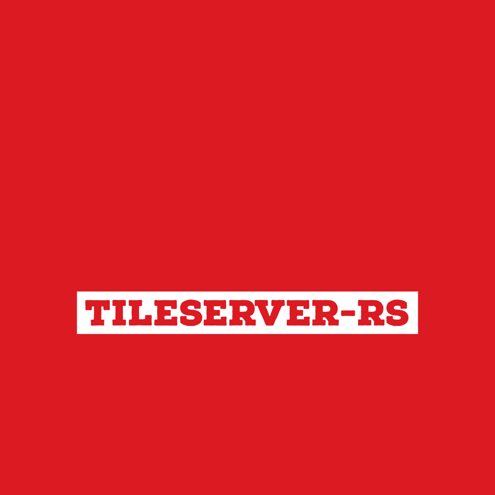

# tileserver-rs 🦀

[](https://github.com/vinayakkulkarni/tileserver-rs/actions/workflows/pipeline.yml)
[](https://github.com/vinayakkulkarni/tileserver-rs/actions/workflows/docker.yml)



High-performance vector tile server built in Rust with a modern Nuxt 4 frontend.

## Features

- **PMTiles Support** - Serve tiles from local and remote PMTiles archives
- **MBTiles Support** - Serve tiles from SQLite-based MBTiles files
- **Native Raster Rendering** - Generate PNG/JPEG/WebP tiles using MapLibre Native (C++ FFI)
- **Static Map Images** - Create embeddable map screenshots (like Mapbox/Maptiler Static API)
- **High Performance** - ~100ms per tile (warm cache), ~800ms cold cache
- **TileJSON 3.0** - Full TileJSON metadata API
- **MapLibre GL JS** - Built-in map viewer and data inspector
- **Docker Ready** - Easy deployment with Docker Compose v2
- **Fast** - Built in Rust with Axum for maximum performance

## Tech Stack

- **Backend**: Rust 1.75+, Axum 0.8, Tokio
- **Native Rendering**: MapLibre Native (C++) via FFI bindings
- **Frontend**: Nuxt 4, Vue 3.5, Tailwind CSS v4, shadcn-vue
- **Tooling**: Bun workspaces, Docker multi-stage builds

## Table of Contents

- [Features](#features)
- [Tech Stack](#tech-stack)
- [Requirements](#requirements)
- [Quick Start](#quick-start)
- [Installation](#installation)
  - [Using Docker](#using-docker)
  - [Building from Source](#building-from-source)
- [Configuration](#configuration)
- [API Endpoints](#api-endpoints)
- [Development](#development)
- [Contributing](#contributing)
- [Author](#author)

## Requirements

- [Rust 1.75+](https://www.rust-lang.org/)
- [Bun 1.0+](https://bun.sh/)
- (Optional) [Docker](https://www.docker.com/)

### For Native Rendering (Optional)

Native raster tile rendering requires building MapLibre Native. If you don't need raster tiles, the server runs without it (stub implementation returns placeholder images).

**macOS (Apple Silicon/Intel):**
```bash
# Install build dependencies
brew install ninja ccache libuv glfw bazelisk cmake

# Build MapLibre Native
cd maplibre-native-sys/vendor/maplibre-native
git submodule update --init --recursive
cmake --preset macos-metal
cmake --build build-macos-metal --target mbgl-core mlt-cpp -j8
```

**Linux:**
```bash
# Install build dependencies (Ubuntu/Debian)
apt-get install ninja-build ccache libuv1-dev libglfw3-dev cmake

# Build MapLibre Native
cd maplibre-native-sys/vendor/maplibre-native
git submodule update --init --recursive
cmake --preset linux
cmake --build build-linux --target mbgl-core mlt-cpp -j8
```

**After building MapLibre Native:**
```bash
# Clear Cargo's cached build to detect the new libraries
cd /path/to/tileserver-rs
rm -rf target/release/build/maplibre-native-sys-*
cargo build --release
```

You should see `Building with real MapLibre Native renderer` in the build output.

## Quick Start

```bash
# Using Docker
docker compose up -d

# Or build from source
cargo build --release
./target/release/tileserver-rs --config config.toml
```

## Installation

### Using Docker

```bash
# Development (builds locally, mounts ./data directory)
docker compose up -d

# Production (uses pre-built image with resource limits)
docker compose -f compose.yml -f compose.prod.yml up -d

# View logs
docker compose logs -f tileserver

# Stop
docker compose down
```

**Or run directly with Docker:**

```bash
docker run -d \
  -p 8080:8080 \
  -v /path/to/data:/data:ro \
  -v /path/to/config.toml:/app/config.toml:ro \
  ghcr.io/vinayakkulkarni/tileserver-rs:latest
```

### Building from Source

```bash
# Clone the repository with submodules
git clone --recursive git@github.com:vinayakkulkarni/tileserver-rs.git
cd tileserver-rs

# Or using HTTPS
git clone --recursive https://github.com/vinayakkulkarni/tileserver-rs.git

# If you already cloned without --recursive:
git submodule update --init --recursive

# Install dependencies
bun install

# Build the Rust backend
cargo build --release

# Build the frontend
bun run build:client

# Run the server
./target/release/tileserver-rs --config config.toml
```

> **Note:** The `--recursive` flag fetches the MapLibre Native submodule (~200MB) required for native raster rendering. If the clone times out, use `git submodule update --init --depth 1` for a shallow clone. See [CONTRIBUTING.md](./CONTRIBUTING.md) for detailed setup instructions.

## Configuration

Create a `config.toml` file. **Important:** Root-level options (`fonts`, `files`) must come before any `[section]` headers:

```toml
# Root-level options (must come BEFORE [sections])
fonts = "/data/fonts"
files = "/data/files"

[server]
host = "0.0.0.0"
port = 8080
cors_origins = ["*", "https://example.com"]  # Supports multiple origins

[telemetry]
enabled = false

[[sources]]
id = "openmaptiles"
type = "pmtiles"
path = "/data/tiles.pmtiles"
name = "OpenMapTiles"
attribution = "© OpenMapTiles © OpenStreetMap contributors"

[[sources]]
id = "terrain"
type = "mbtiles"
path = "/data/terrain.mbtiles"
name = "Terrain Data"

[[styles]]
id = "osm-bright"
path = "/data/styles/osm-bright/style.json"
```

See [config.example.toml](./config.example.toml) for a complete example, or [config.offline.toml](./config.offline.toml) for a local development setup.

## API Endpoints

### Data Endpoints (Vector Tiles)

| Endpoint | Description |
|----------|-------------|
| `GET /health` | Health check |
| `GET /data.json` | List all tile sources |
| `GET /data/{source}.json` | TileJSON for a source |
| `GET /data/{source}/{z}/{x}/{y}.{format}` | Get a vector tile (`.pbf`, `.mvt`) |
| `GET /data/{source}/{z}/{x}/{y}.geojson` | Get tile as GeoJSON (for debugging) |

### Style Endpoints

| Endpoint | Description |
|----------|-------------|
| `GET /styles.json` | List all styles |
| `GET /styles/{style}/style.json` | Get MapLibre GL style JSON |
| `GET /styles/{style}/sprite[@2x].{png,json}` | Get sprite image/metadata |
| `GET /styles/{style}/wmts.xml` | WMTS capabilities (for QGIS/ArcGIS) |

### Font Endpoints

| Endpoint | Description |
|----------|-------------|
| `GET /fonts.json` | List available font families |
| `GET /fonts/{fontstack}/{range}.pbf` | Get font glyphs (PBF format) |

### Other Endpoints

| Endpoint | Description |
|----------|-------------|
| `GET /files/{filepath}` | Serve static files (GeoJSON, icons, etc.) |
| `GET /index.json` | Combined TileJSON for all sources and styles |

### Rendering Endpoints (Native MapLibre)

| Endpoint | Description |
|----------|-------------|
| `GET /styles/{style}/{z}/{x}/{y}[@{scale}x].{format}` | Raster tile (PNG/JPEG/WebP) |
| `GET /styles/{style}/static/{type}/{size}[@{scale}x].{format}` | Static map image |

**Raster Tile Examples:**
```
/styles/protomaps-light/14/8192/5461.png          # 512x512 PNG @ 1x
/styles/protomaps-light/14/8192/5461@2x.webp      # 1024x1024 WebP @ 2x (retina)
```

**Performance:**
- Warm cache: ~100ms per tile
- Cold cache: ~700-800ms per tile (includes tile fetching)
- Static images: ~3s for 800x600

**Static Image Types:**
- **Center**: `{lon},{lat},{zoom}[@{bearing}[,{pitch}]]`
  ```
  /styles/protomaps-light/static/-122.4,37.8,12/800x600.png
  /styles/protomaps-light/static/-122.4,37.8,12@45,60/800x600@2x.webp
  ```
- **Bounding Box**: `{minx},{miny},{maxx},{maxy}`
  ```
  /styles/protomaps-light/static/-123,37,-122,38/1024x768.jpeg
  ```
- **Auto-fit**: `auto` (with `?path=` or `?marker=` query params)
  ```
  /styles/protomaps-light/static/auto/800x600.png?path=path-5+f00(-122.4,37.8|-122.5,37.9)
  ```

**Static Image Limits:**
- Maximum dimensions: 4096x4096 pixels
- Maximum scale: 4x

## Development

```bash
# Install dependencies
bun install

# Start Rust backend (with hot reload via cargo-watch)
cargo watch -x run

# Start Nuxt frontend (in another terminal)
bun run dev:client

# Run linters
bun run lint
cargo clippy

# Build for production
cargo build --release
bun run build:client
```

### Project Structure

```
tileserver-rs/
├── apps/
│   ├── client/              # Nuxt 4 frontend
│   └── docs/                # Documentation site
├── maplibre-native-sys/     # FFI bindings to MapLibre Native (C++)
│   ├── cpp/                 # C/C++ wrapper code
│   │   ├── maplibre_c.h     # C API header
│   │   └── maplibre_c.cpp   # C++ implementation
│   ├── src/lib.rs           # Rust FFI bindings
│   ├── build.rs             # Build script
│   └── vendor/maplibre-native/  # MapLibre Native source (submodule)
├── src/                     # Rust backend
│   ├── main.rs              # Entry point, routes
│   ├── config.rs            # Configuration
│   ├── error.rs             # Error types
│   ├── render/              # Native MapLibre rendering
│   │   ├── pool.rs          # Renderer pool (per scale factor)
│   │   ├── renderer.rs      # High-level render API
│   │   ├── native.rs        # Safe Rust wrappers around FFI
│   │   └── types.rs         # RenderOptions, ImageFormat, etc.
│   ├── sources/             # Tile source implementations
│   └── styles/              # Style management + rewriting
├── compose.yml              # Docker Compose (development)
├── compose.prod.yml         # Docker Compose (production overrides)
├── Dockerfile               # Multi-stage Docker build
└── config.example.toml      # Example configuration
```

## Contributing

We welcome contributions! Please see [CONTRIBUTING.md](./CONTRIBUTING.md) for detailed guidelines.

**Quick Start:**

1. Fork it ([https://github.com/vinayakkulkarni/tileserver-rs/fork](https://github.com/vinayakkulkarni/tileserver-rs/fork))
2. Clone with submodules: `git clone --recursive <your-fork-url>`
3. Create your feature branch (`git checkout -b feat/new-feature`)
4. Commit your changes (`git commit -Sam 'feat: add feature'`)
5. Push to the branch (`git push origin feat/new-feature`)
6. Create a new [Pull Request](https://github.com/vinayakkulkarni/tileserver-rs/compare)

**Working with Git Submodules:**

```bash
# After cloning (if you forgot --recursive)
git submodule update --init --recursive

# After pulling changes from upstream
git pull
git submodule update --init --recursive

# If clone times out (shallow clone)
git submodule update --init --depth 1
```

**Notes:**

1. Please contribute using [GitHub Flow](https://guides.github.com/introduction/flow/)
2. Commits & PRs will be allowed only if the commit messages & PR titles follow the [conventional commit standard](https://www.conventionalcommits.org/)
3. Ensure your commits are signed. [Read why](https://withblue.ink/2020/05/17/how-and-why-to-sign-git-commits.html)

## Author

**tileserver-rs** © [Vinayak](https://vinayakkulkarni.dev), Released under the [MIT](./LICENSE) License.

Authored and maintained by Vinayak Kulkarni with help from contributors ([list](https://github.com/vinayakkulkarni/tileserver-rs/contributors)).

> [vinayakkulkarni.dev](https://vinayakkulkarni.dev) · GitHub [@vinayakkulkarni](https://github.com/vinayakkulkarni) · Twitter [@_vinayak_k](https://twitter.com/_vinayak_k)

### Special Thanks

- [tileserver-gl](https://github.com/maptiler/tileserver-gl) - Inspiration for this project
- [MapLibre](https://maplibre.org/) - Open-source mapping library
- [PMTiles](https://github.com/protomaps/PMTiles) - Cloud-optimized tile archive format
